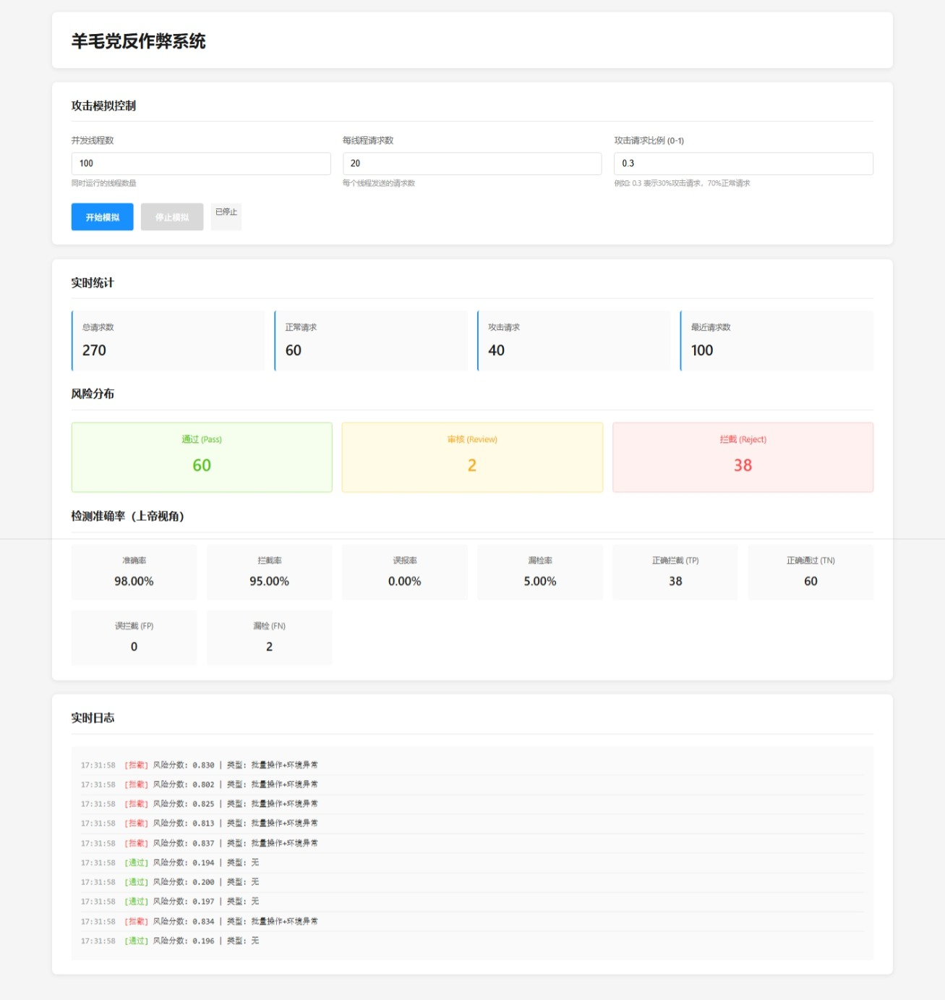

# 羊毛党反作弊系统

基于AI的实时风控检测系统，用于识别和拦截电商平台的羊毛党批量注册行为。



## 项目结构

```
risk/
├── config.py                 # 配置文件
├── requirements.txt          # 依赖包
├── sitecustomize.py         # Python全局配置（禁用__pycache__）
├── app.py                   # 主启动文件（Web UI）
├── generate_data.py         # 训练数据生成脚本
├── models/                  # 模型相关
│   ├── feature_extractor.py # 特征提取
│   ├── risk_model.py        # 风控模型
│   ├── train_model.py       # 模型训练
│   └── models/              # 保存训练好的模型
│       ├── xgb_model.pkl    # XGBoost模型
│       └── isolation_forest.pkl # Isolation Forest模型
├── simulator/               # 攻击模拟器
│   └── attacker.py          # 羊毛党模拟器
├── web/                     # Web UI和API服务
│   ├── server.py            # Flask服务器（API接口）
│   └── index.html           # 前端页面
├── utils/                   # 工具函数
│   ├── data_generator.py    # 数据生成器
│   └── common.py            # 通用工具函数
└── data/                    # 数据目录
    ├── training_data.csv    # 训练数据
    └── log/                 # 实时日志文件
        └── attack_*.jsonl   # 每次模拟运行的日志
```

## 快速开始

### 1. 环境准备

```bash
conda activate fk
pip install -r requirements.txt
```

### 2. 生成训练数据

```bash
python generate_data.py
```

### 3. 训练模型

```bash
python models/train_model.py
```

### 4. 启动服务

```bash
python app.py
```

服务将在 http://localhost:5000 启动，自动打开浏览器。

### 5. 运行攻击模拟（可选）

在Web界面中点击"开始模拟"按钮，设置参数后启动模拟。也可以在浏览器中直接访问 http://localhost:5000 使用Web UI控制模拟。

## 功能特性

### 1. AI风控模型

- **XGBoost监督学习模型**：基于历史数据训练，识别批量操作模式
- **IsolationForest无监督模型**：检测异常聚类和IP/设备聚集
- **多模型融合**：加权融合监督和无监督模型结果

### 2. 数据特征说明

系统从原始数据中提取**42维特征向量**，包括：
- **原始数据字段**：17个字段（基本信息、环境特征、行为特征）
- **特征工程**：42维特征向量（聚集度、行为、账号、时间、设备指纹、网络、关联、组合风险分数）

📖 **详细特征说明请查看：[特征说明.md](特征说明.md)**

该文档包含：
- 原始数据字段详细说明（17个字段）
- 特征工程完整列表（42维特征的详细计算方法和说明）
- 特征差异对比（正常用户 vs 羊毛党）
- 特征提取器工作原理和空值处理策略
- 使用示例

### 3. 实时决策

- **Pass（正常）**：风险分数 < 0.5，正常发券
- **Review（审核）**：风险分数 0.5-0.8，加验证码/限流
- **Reject（拦截）**：风险分数 > 0.8，直接拦截

### 5. Web监控界面


- 实时统计数据展示
- 攻击控制面板
- 请求日志查看
- 风险分布可视化

## API接口

- `POST /api/register` - 注册接口（风控检测）
- `POST /api/start_attack` - 启动攻击模拟
- `POST /api/stop_attack` - 停止攻击模拟
- `GET /api/stats` - 获取统计数据
- `GET /api/history` - 获取请求历史
- `GET /api/health` - 健康检查

## 配置说明

在 `config.py` 中可以配置：
- API端口和主机
- 风控阈值
- 攻击模拟参数
- 模型路径

## 技术栈

- **后端**: Flask
- **机器学习**: XGBoost, scikit-learn
- **前端**: HTML/CSS/JavaScript
- **数据处理**: NumPy, Pandas


## 许可证

MIT License
