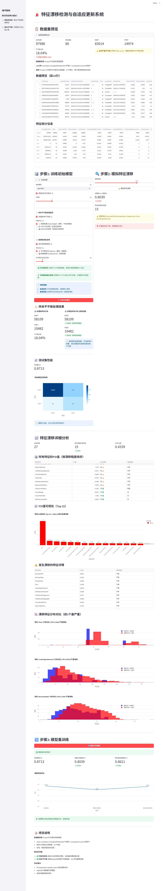

# 特征漂移检测与自适应更新系统

## 📸 页面预览
👉 [点击查看系统截图](#系统截图)

## 项目简介
风控场景中的特征漂移检测与自适应更新系统，解决：
- **特征失效快** - 黑灰产快速变换特征，导致模型性能下降
- **样本不平衡** - 作弊用户永远是少数，需要特殊处理

## 技术要点
| 技术点 | 说明 |
|--------|------|
| **🤖 多模型选择** | **LightGBM** - 梯度提升框架，速度快<br>**XGBoost** - 极端梯度提升，性能强<br>**Random Forest** - 随机森林，稳定性好<br>**CatBoost** - 类别特征优化，精度高 |
| **⚖️ 样本不平衡处理** | **类别权重 (Class Weight)** - 推荐方案，不改变数据分布<br>**📈 SMOTE过采样** - 生成合成样本<br>**📊 ADASYN过采样** - 自适应合成样本 |
| **🔍 特征漂移检测** | 模拟特征漂移计算PSI值<br>漂移特征分布对比（前3个最严重）<br>实时监控模型性能下降 |
| **⚙️ 超参数调优** | **🚀 贝叶斯优化 (Optuna)** - 推荐，速度快<br>**📊 网格搜索 (GridSearchCV)** - 全面但慢 |
| **✅ 模型验证** | 使用K折交叉验证确保模型泛化能力 |

## 未加入的功能

1. **增量训练与模型更新** - 未加入短期内需要增量训练，长期需要更新完整模型的功能
2. **停止训练** - 未增加训练过程中的停止训练功能
3. **多核训练** - 未增加多核训练功能

## 数据集
**Prosper平台真实贷款数据**
- 数据位置：`backend/data/prosperLoanData.csv`
- Label：`LoanStatus` (Chargedoff/Defaulted=1, Completed/Current=0)
- 数据量：10万+条，27个重要特征

## 项目结构
```
content_risk_demo/
├── backend/
│   ├── models/          # 模型训练和漂移检测
│   ├── data/            # 数据目录
│   └── requirements.txt
├── frontend/
│   └── app.py           # Streamlit前端
└── README.md
```

## 快速开始
```bash
# 1. 激活环境
conda activate fk

# 2. 安装依赖
cd content_risk_demo/backend
pip install -r requirements.txt

# 3. 运行前端
cd content_risk_demo
python start.py
```

浏览器自动打开 http://localhost:8501

## 系统截图



