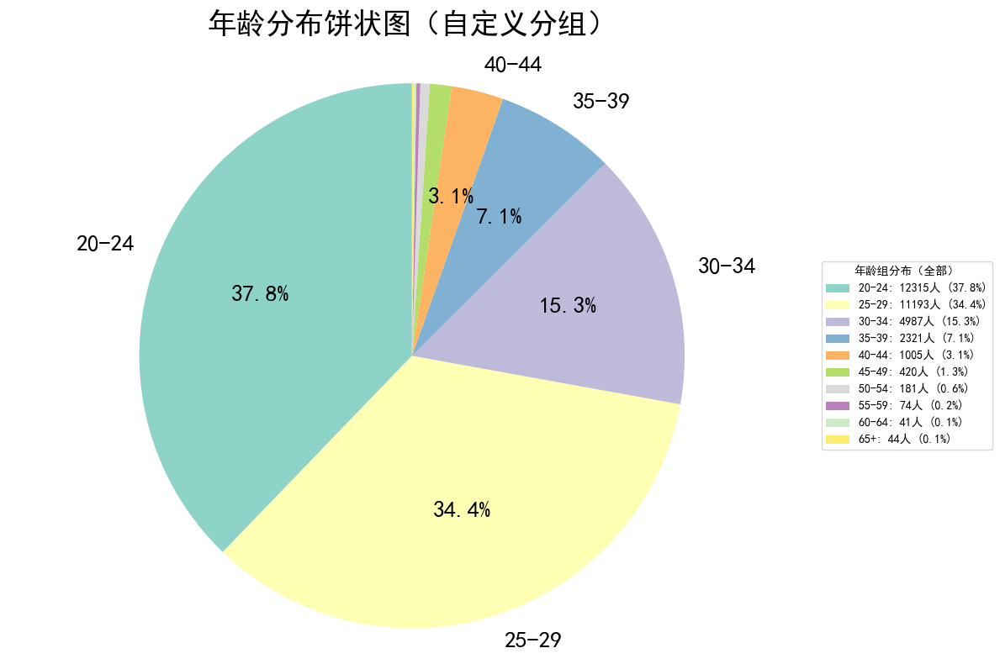
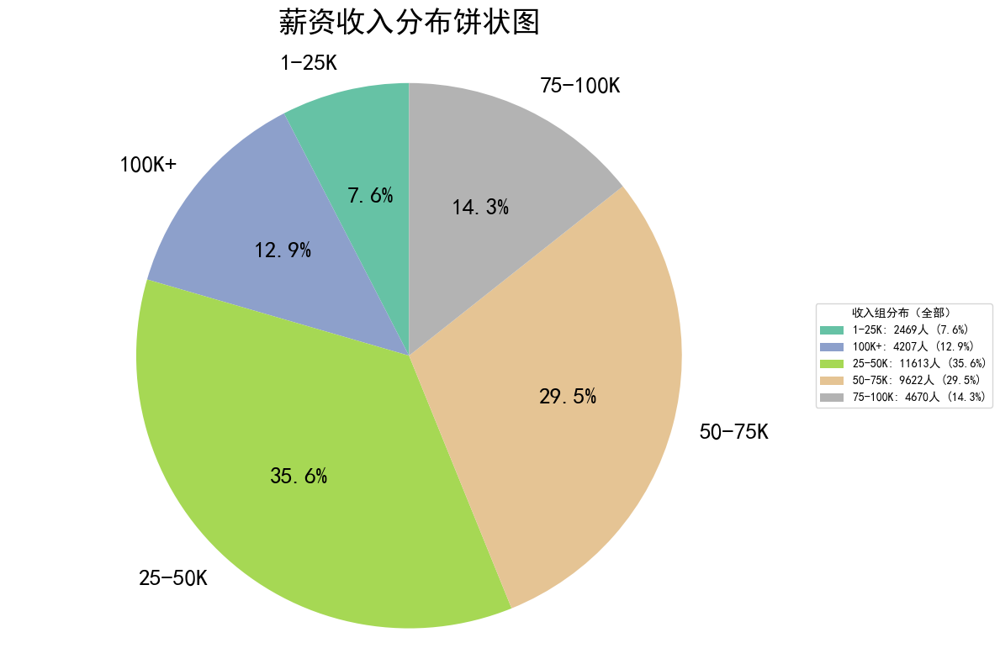
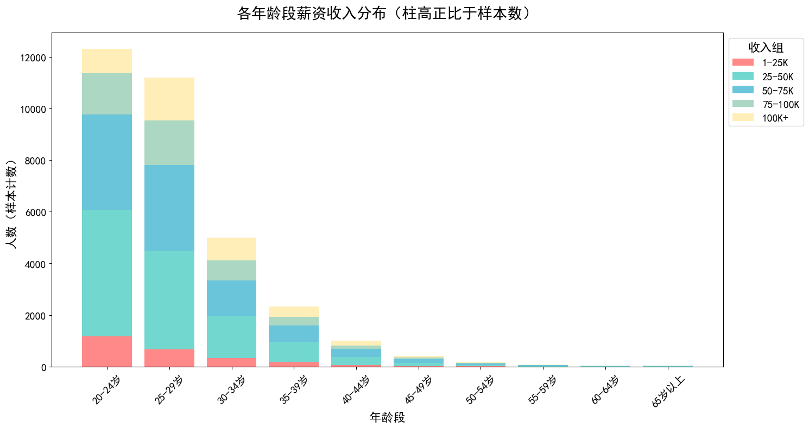
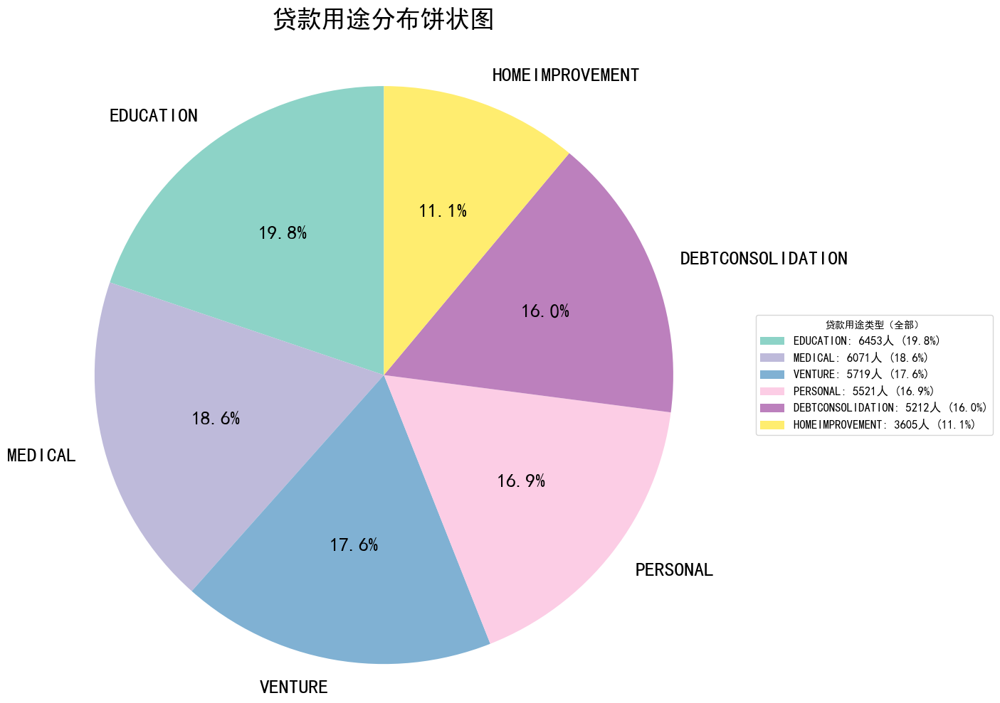

# 信用评分风控分析

基于机器学习的信用风险评估项目，使用XGBoost、MLP等算法预测贷款违约风险。

## 📊 数据集概览

- **数据来源**：[Kaggle信用风险数据集](https://www.kaggle.com/datasets/laotse/credit-risk-dataset/data)
- **样本数量**：32,581条贷款记录
- **特征维度**：12个特征（年龄、收入、贷款信息等）
- **目标**：预测贷款违约状态（0=正常，1=违约）

### 📋 特征说明

| 特征名称 | 类型 | 说明 |
|---------|------|------|
| `person_age` | 数值型 | 借款人年龄（岁） |
| `person_income` | 数值型 | 借款人年收入（美元） |
| `person_home_ownership` | 分类型 | 住房所有权（租房/抵押/自有） |
| `person_emp_length` | 数值型 | 就业年限（年） |
| `loan_intent` | 分类型 | 贷款用途（教育/医疗/创业等） |
| `loan_grade` | 分类型 | 贷款等级（A-G，A为最优） |
| `loan_amnt` | 数值型 | 贷款金额（美元） |
| `loan_int_rate` | 数值型 | 贷款利率（%） |
| `loan_percent_income` | 数值型 | 贷款收入比（贷款金额/年收入） |
| `cb_person_default_on_file` | 分类型 | 历史违约记录（是/否） |
| `cb_person_cred_hist_length` | 数值型 | 信用历史长度（年） |
| `loan_status` | 分类型 | 贷款状态（0=正常，1=违约） |

## 🎯 主要发现

### 借款人特征分布
- **年龄**：主要集中在20-35岁
- **收入**：25-50K群体占比最高（35.6%）
- **住房**：租房50.5%，抵押贷款41.3%







### 贷款用途
- 教育贷款：19.8%
- 医疗贷款：18.6% 
- 创业贷款：17.6%



## 🤖 模型性能

| 模型 | 准确率 | ROC-AUC |
|------|--------|---------|
| 逻辑回归 | 84.4% | 85.2% |
| 决策树 | 88.4% | 84.1% |
| 随机森林 | 93.1% | 93.3% |
| **XGBoost** | **93.7%** | **94.8%** |

**最佳模型**：XGBoost，ROC-AUC达到94.8%

## 🔧 技术栈

Python + pandas + scikit-learn + XGBoost + matplotlib + seaborn

## 🚀 快速开始

```bash
# 安装依赖
pip install pandas numpy matplotlib seaborn scikit-learn xgboost

# 运行分析
jupyter notebook 信用评分风控分析.ipynb
```

## 📁 文件结构

```
信用评分风控/
├── dataset/credit_risk_dataset.csv    # 数据集
├── 信用评分风控分析.ipynb            # 分析代码
└── README.md                         # 说明文档
```

## 📈 关键洞察

1. **高风险因素**：低信用等级、高利率、高收入比
2. **模型表现**：XGBoost在信用风险评估中表现最优
3. **业务价值**：可有效识别高风险贷款申请，降低违约损失

---

*完整的分析过程和可视化图表请查看Jupyter notebook文件*